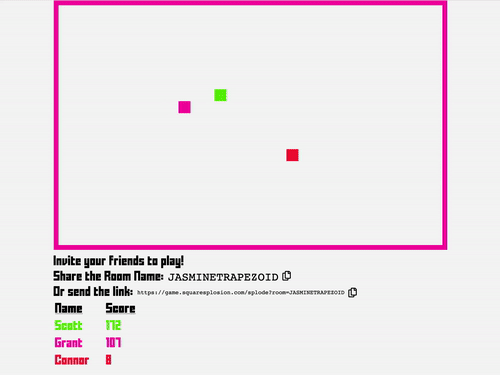

# Squaresplosion

Squaresplosion is a game about squares... and explosions. Move around to increase your score. Run into other player squares to explode them. Be careful though, if another square runs into you, you explode! 

    

## FAQ

### How does it work?

The frontend is simple static HTML/CSS/JS. The game is on an HTML5 Canvas. Multiplayer coordination is handled via a central stateful websocket server, written in Rust. All state is in-memory.

### No - I meant how do I play??

Oh. `WASD` or arrow keys to move. That's about it.

### Can I play with others?

You can _only_ play with others! There is no single player mode. Pick a room name and send it to your friends. After you all join the same room, you can start squaresploding.

### The colors are inconsistent, why?

Because we didn't build in functionality to keep consistent colors. As a result, sometimes you and another square will be the same color. We are sorry.

### The square that explodes after a collision seems random sometimes - whats the deal?

Whoever enters a space of an existing square wins. As an example, if square A is sitting still and square B moves into square A, square A will explode. If both squares are moving, then the square that wins depends on which movement command reached the server first. The server is in New York - plan accordingly.

